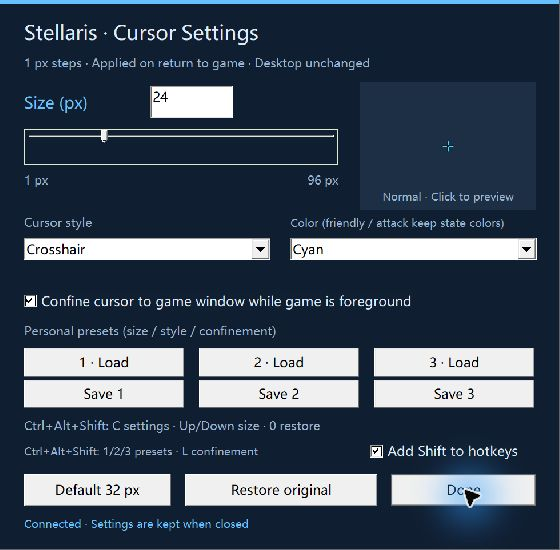

# CursorBridge

[简体中文](README.zh-CN.md) · [Download Windows x64](https://github.com/shenbo1264/cursorbridge/releases/tag/v0.7.0) · [Roadmap](docs/ROADMAP.md)

An open-source project for making game cursors easier to see and customize. **The first working adapter is for Stellaris on Windows x64.** Built-in original themes are available; other games, user-imported packs and an editor are future work.


## What works in v0.7.0

- A **1–96 pixel** keyboard-accessible slider and exact size input. 1 px is an extreme option; start with 24–32 px. 96 px is available for accessibility and demonstrations.
- **12 original cursor sets**: contrast arrow, crosshair or ring × white, cyan, amber or pink. Friendly/attack/blocked state colors, grab states and native busy/movement animation are included. In 4.5.1, normal/selected/dragselect are identical source pointers and share the basic shape.
- Three saved presets (size, theme, confinement), game-scoped shortcuts and optional foreground-only window confinement. See [controls and feature comparison](docs/YOLOMOUSE_COMPARISON.md).
- Keeps the installed game's cursor art, hotspots and existing animated cursors. No game art is bundled in this repository or release.
- Changes recognized Stellaris cursors while the game is foreground and the pointer is over its client area. Windows desktop pointer preferences are unchanged.
- Restore the original cursor or quit the companion from its tray menu. The last selected size is saved locally.
- Chinese UI when the game's language is Chinese; English for other languages. Reads the active `-userdir` profile as well as the default profile.
- Detects Steam libraries and a running Stellaris installation; supports manual executable selection and command-line configuration.
- An optional Workshop script mod opens the slider from an in-game event or an edict. **A companion program is required. Subscribing alone does not resize the cursor.**

This is an early release, verified against **Stellaris 4.5.1 on Windows x64**. There is no Linux/macOS build, universal-game support or multiplayer certification.



## Download and start

1. Open the [v0.7.0 Release page](https://github.com/shenbo1264/cursorbridge/releases/tag/v0.7.0) and download `CursorBridge-Stellaris-windows-x64.zip` from Assets. The automatically generated “Source code” archives are for developers.
2. Extract the entire ZIP to a folder you control. Keep `bin/StellarisCursor.exe`, `bin/StellarisCursorHook.dll` and `bin/assets/themes/` together. No installer or Python is needed for the companion.
3. Run `Open Settings.cmd` or `bin/StellarisCursor.exe --settings`.
4. Start Stellaris normally through Steam / its launcher. The tool connects automatically and shows its status in the tray and panel. Use the slider, close the panel and play.
5. If the game is not found, right-click the tray icon and choose **Select Stellaris installation…**, then select `stellaris.exe` inside the installed game's folder. All nine `gfx/cursors` resources must be present.

Run at the same privilege level as the game. Normally neither needs administrator rights. No service, driver, startup registration, telemetry or internet access is used by the application. This initial binary is unsigned, and a public GitHub repository is not a security certification. Source, build instructions and SHA256 sums are provided for inspection; do not disable security software to use it.

The default configuration is `%LOCALAPPDATA%/CursorBridge/settings.ini`; diagnostics stay under `%LOCALAPPDATA%/CursorBridge/logs`. The game's default profile is resolved through Windows Known Folders, including redirected Documents folders. The executable location is remembered only if you explicitly select it.

### Commands

```text
StellarisCursor.exe --settings
StellarisCursor.exe --launch
StellarisCursor.exe --stop
StellarisCursor.exe --game-path "D:\SteamLibrary\steamapps\common\Stellaris\stellaris.exe" --settings
StellarisCursor.exe --data-dir "D:\CursorBridgeData"
StellarisCursor.exe --game-log "D:\CustomStellarisProfile\logs\game.log"
```

`--launch` runs the detected executable with `-skiploop`; launch through Steam/Paradox Launcher when you want the usual launcher workflow. `--game-log` is an advanced override for the in-game bridge. A game started with `-userdir` is normally detected without an override. Unsupported or incomplete options return exit code 2. Restart the game before changing to a new DLL build.

## Workshop integration

The `workshop/` folder contains **original scripts and localization only**. It adds a single-player event and a free **Cursor size settings** edict. It uses uniquely named files, adds an on-action rather than replacing `00_on_actions.txt`, and does not replace UOD / Dark Blue GUI files. The core was smoke-tested with UOD and Dark Blue UI; this is not a blanket compatibility guarantee for every playset.

No Workshop item has been published yet. Install the optional local mod through the launcher following [the upload/local-install guide](docs/WORKSHOP_UPLOAD.md). The companion also works through its tray without a mod. The bridge uses single-player script/event logs; old requests are ignored on connection. Start the companion before opening the event, or reopen the edict afterward. Multiplayer support has not been tested. The Workshop scripts affect the game checksum; achievements are not promised.

The slider is a companion's floating panel. It is not a newly registered engine setting. An advanced **local settings-page button generator** is available in `tools/create_settings_patch.py`; it needs Python 3.10+ and a matching installed UI source. The generated GUI stays on your machine, loads after the UI it was generated from and must be regenerated after UI updates. The UOD + Dark Blue prototype was tested; vanilla/other UI variants need their own layout validation. Do not upload the generated third-party GUI to Workshop. See [architecture and limitations](docs/ARCHITECTURE.md).

## Build and verify

Requirements: Windows x64, Visual Studio 2022 C++ Build Tools with Windows SDK, CMake 3.21+, Python 3.10+ for fixture/mod tooling. No third-party hooking library is included.

The optional original-cover generator also needs Pillow and a Windows Segoe UI font; it is not required to build or run the application.

```powershell
cmake -S . -B build -A x64
cmake --build build --config Release
ctest --test-dir build -C Release --output-on-failure
python tools/make_test_assets.py "build/Synthetic Game"
```

The full hook regression needs `StellarisCursorTest.exe` next to the tool. Run from PowerShell and wait for its exit code:

```powershell
$fixture = Join-Path (Get-Location) 'build\Synthetic Game\stellaris.exe'
$data = Join-Path (Get-Location) 'build\test-data'
$test = Start-Process -FilePath 'build\bin\StellarisCursor.exe' -ArgumentList ('--self-test --game-path "{0}" --data-dir "{1}"' -f $fixture, $data) -PassThru -WindowStyle Hidden -Wait
$test.ExitCode
```

The fixture executable is a **layout marker that is never run or injected**. The only test injection target is the separately built, exact-path `StellarisCursorTest.exe`. Tests use original synthetic CUR/ANI files, so CI does not need Stellaris. For local regression against a legitimately installed game, supply its executable as `--game-path`; the tests still run in the isolated test host, not a savegame. Reports are written under `build/logs` and the selected data directory.

The native suite covers 40,700 checks: all nine resources × 96 sizes in original mode and 12 themes, hotspot bounds, rendered pixels, animated second frames, `SetCursor` return semantics, invalid values, original handles, restoration and heartbeat expiry. Bridge, language/profile, preferences and path tests run separately. See [validation scope](docs/VALIDATION.md); these counts do not replace long-session gameplay testing.

## Contribute

Please read [CONTRIBUTING.md](CONTRIBUTING.md), [SECURITY.md](SECURITY.md) and the [roadmap](docs/ROADMAP.md). Report the game version, tool version and steps to reproduce. Remove personal paths and save information from logs before posting.

CursorBridge is independently implemented. It is not affiliated with Paradox Interactive, Steam or YoloMouse. Stellaris and related game assets belong to their respective owners. Original code, scripts, synthetic test fixtures and project artwork are available under the [MIT license](LICENSE); game resources and locally generated third-party UI are not covered by that license.
