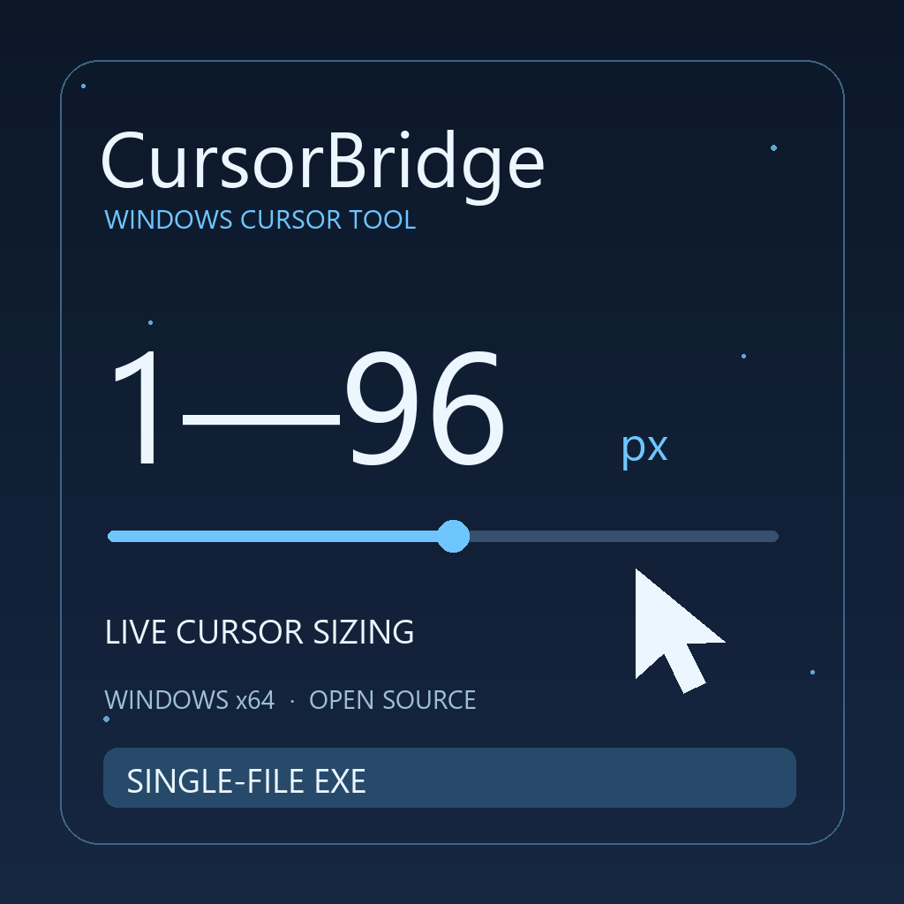
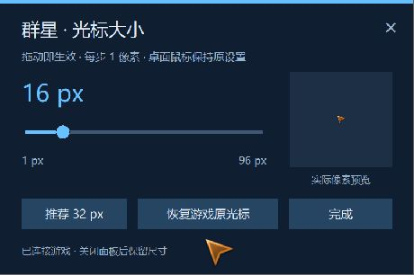

# CursorBridge

[English](README.md) · [下载 Windows x64 程序](https://github.com/shenbo1264/cursorbridge/releases/tag/v0.6.0) · [后续路线](docs/ROADMAP.md)

一个让游戏光标更容易看清、也更容易调整的开源项目。**目前已实现的是《群星》的 Windows x64 版本**；其他游戏、自定义光标样式和动画包仍在规划中。



## 当前功能

- **1–96 像素实时滑块**，每步 1 像素。建议先用 24–32 px；1 px 是极限选项，96 px 可用于大光标需求或演示。
- 使用玩家已安装游戏中的光标，保留原有造型、点击热点和动画。项目与下载包均不附带游戏原始素材。
- 游戏处于前台、鼠标位于游戏客户区时，调整已识别的《群星》光标。Windows 桌面鼠标偏好保持原样。
- 随时恢复原光标；退出程序也会请求恢复。尺寸选择保存在本机。
- 游戏设置为中文时显示中文，其他语言显示英文；支持默认用户目录和 `-userdir` 独立目录。
- 自动识别 Steam 游戏库及运行中的《群星》，也能从托盘菜单手动选择安装位置。
- 可选的工坊脚本模组提供开局事件和法令入口。**需要运行配套程序，仅订阅模组不能改变光标尺寸。**

这是首个公开测试版本，已针对 **Windows x64 /《群星》4.5.1** 验证。尚未支持 Linux、macOS、任意游戏或经过验证的多人联机。



## 下载与使用

1. 打开 [v0.6.0 Release 页面](https://github.com/shenbo1264/cursorbridge/releases/tag/v0.6.0)，在 Assets 下载 `CursorBridge-Stellaris-windows-x64.zip`。自动生成的 Source code 压缩包供开发者使用。
2. 完整解压到自己有写入权限的目录，保留 `bin/StellarisCursor.exe` 与 `bin/StellarisCursorHook.dll` 的相对位置。配套程序无需安装器或 Python。
3. 双击 `Open Settings.cmd`，或运行 `bin/StellarisCursor.exe --settings`。
4. 正常通过 Steam / 启动器进入游戏，程序会自动连接。拖动滑块，关闭面板后继续游戏。
5. 如果没有找到游戏，右键系统托盘里的工具图标，选择“选择《群星》安装位置…”，定位到完整游戏目录中的 `stellaris.exe`。

游戏与程序应处于相同权限级别，通常均不需要管理员权限。程序不安装服务或驱动，不注册开机启动，不收集遥测，不发起网络请求。首版程序尚未签名；GitHub 开源并不等于安全认证。我们提供源码、构建说明与 SHA256 校验，不建议为运行它关闭安全软件。

用户设置位于 `%LOCALAPPDATA%/CursorBridge/settings.ini`，本地日志位于同目录的 `logs` 文件夹。游戏文档目录通过 Windows 已知文件夹接口查找，可适配重定向的 Documents。只有玩家主动选择的游戏路径才会保存到配置文件。

## 工坊与原生设置页

`workshop/` 只包含原创脚本和本地化。启用后，单人开局事件与免费“鼠标大小设置”法令可打开滑块。核心包使用独立文件追加开局钩子，不覆盖 `00_on_actions.txt` 或 UOD / 暗蓝 UI。已在 UOD + Dark Blue UI 的独立配置中做过验证，但不能据此保证所有模组组合绝对兼容。

当前尚未发布 Steam 工坊条目；可根据[上传与本地安装说明](docs/WORKSHOP_UPLOAD.md)注册本地模组。单独使用托盘面板不需要模组。连接时会跳过历史日志请求，请先启动工具再点击游戏入口，或在连接后重新打开法令。多人模式未验证；脚本模组会影响校验码，不承诺成就兼容。

实时滑块由配套程序提供，是浮动面板。`tools/create_settings_patch.py` 可根据本机已安装 UI 生成**可选的原生设置页按钮**，需要 Python 3.10+。生成后排在所使用 UI 与核心包之后，UI 更新后重新生成。UOD + 暗蓝的原型已验证，原版或其他 UI 的布局仍需分别测试。生成物包含本机 UI 文件，不能作为项目素材再上传工坊。

## 常用参数

```text
StellarisCursor.exe --settings
StellarisCursor.exe --launch
StellarisCursor.exe --stop
StellarisCursor.exe --game-path "D:\SteamLibrary\steamapps\common\Stellaris\stellaris.exe" --settings
StellarisCursor.exe --data-dir "D:\CursorBridgeData"
StellarisCursor.exe --game-log "D:\CustomStellarisProfile\logs\game.log"
```

`--launch` 直接运行已识别的游戏，参数为 `-skiploop`；需要启动器流程时仍从 Steam / Paradox Launcher 启动。`--game-log` 用于特殊日志目录，正常的 `-userdir` 会自动识别。切换 DLL 版本前先退出游戏，再更新工具。

## 开发与验证

需要 Windows x64、Visual Studio 2022 C++ Build Tools / Windows SDK、CMake 3.21+。Python 3.10+ 用于测试素材和模组工具。没有依赖第三方注入或钩子库。

```powershell
cmake -S . -B build -A x64
cmake --build build --config Release
ctest --test-dir build -C Release --output-on-failure
python tools/make_test_assets.py "build/Synthetic Game"
```

完整原生测试的启动与等待示例见 [英文 README](README.md#build-and-verify)。自动测试采用原创的 CUR/ANI 素材，布局标记 `stellaris.exe` 不会被执行或注入；注入目标仅限同目录内构建的专用测试宿主。也可用本机合法游戏目录做资源回归，测试仍在独立宿主中进行。

原生套件包含 **4,771 项检查**，覆盖九类光标、96 档尺寸、热点边界、实际绘制、动画第二帧、无效尺寸、恢复、心跳失效和系统光标保护。另有通讯、本地化、用户目录和安装路径测试。测试范围与未覆盖项目见 [验证记录](docs/VALIDATION.md)。

欢迎参与[后续路线](docs/ROADMAP.md)中的通用游戏适配、样式包和动画管理。提报问题前请移除日志中的个人路径与存档信息。原创代码、脚本、测试素材与项目封面采用 [MIT](LICENSE) 协议；《群星》素材和本机生成的第三方 UI 不在该授权内。

本项目独立开发，与 Paradox Interactive、Steam 或 YoloMouse 无关联。
